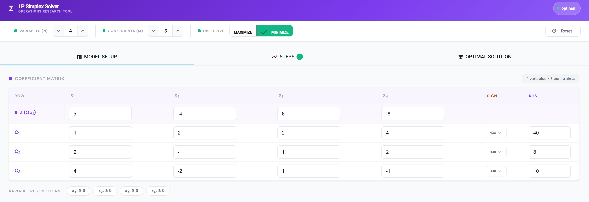
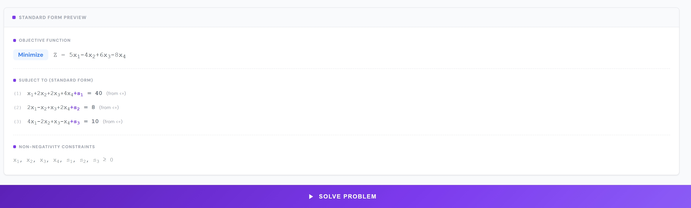
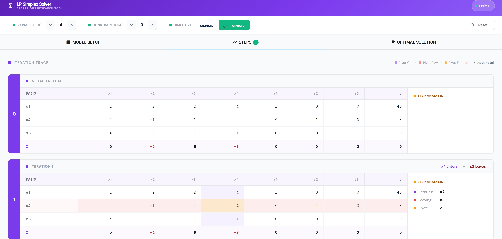
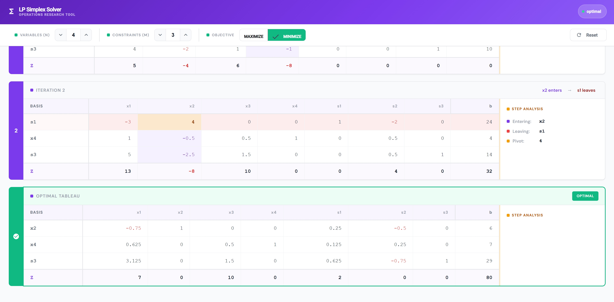
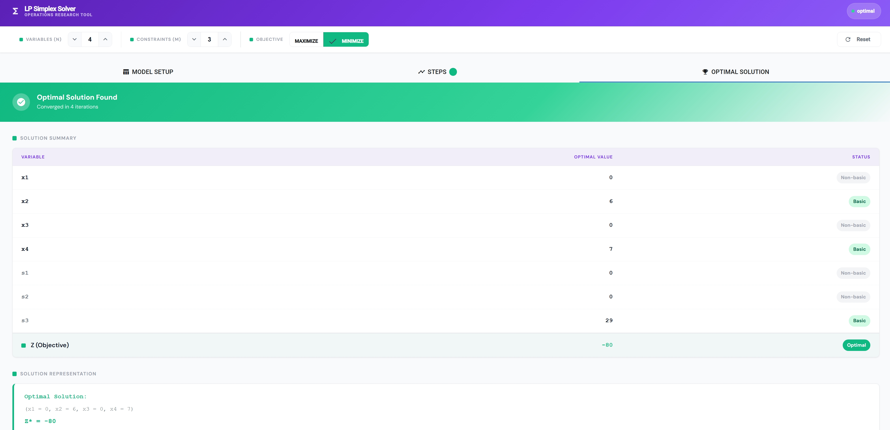
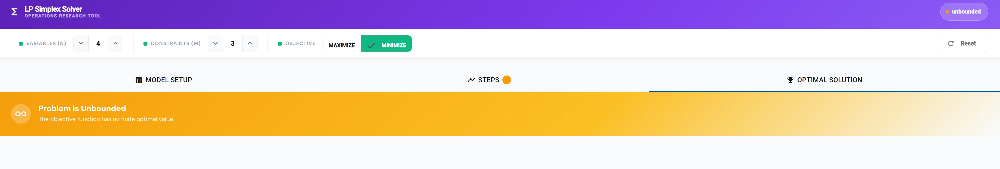
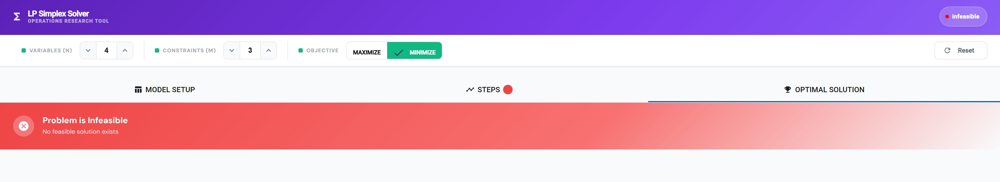

# LP Simplex Solver

A full-stack web application for solving **Linear Programming problems** step-by-step using the **Two-Phase Simplex Method**. Built for Operations Research coursework and study.

<p align="center">
  
</p>

---

## Features

- **Maximize or Minimize** any LP objective function
- Supports **≤, ≥, and =** constraints
- Handles **unrestricted variables** (split into positive/negative parts)
- Full **Two-Phase Simplex** implementation for problems requiring artificial variables
- **Step-by-step tableau trace** with pivot highlighting (entering variable, leaving variable, pivot element)
- **Standard form preview** before solving
- Detects and reports **Optimal**, **Infeasible**, and **Unbounded** outcomes

---

## Tech Stack

| Layer | Technology |
|---|---|
| Frontend | Angular 19 + Angular Material |
| Backend | Python + FastAPI |
| Algorithm | Two-Phase Simplex (NumPy) |
| API | REST — `POST /solve` |

---

## Getting Started

### Backend

```bash
cd backend
pip install -r requirements.txt
uvicorn api.controller:app --reload
```

The API will be available at `http://localhost:8000`.

### Frontend

```bash
cd frontend
npm install
ng serve
```

The app will be available at `http://localhost:4200`.

---

## Usage

### 1. Model Setup

Set the number of variables (N) and constraints (M) using the steppers in the header, then choose **Maximize** or **Minimize**.

Fill in the coefficient matrix — one row for the objective function and one row per constraint. Set the sign (`<=`, `>=`, `=`) and RHS value for each constraint. Toggle variable restrictions between `≥ 0` and `URS` (unrestricted).

The **Standard Form Preview** updates live, showing you exactly how the problem will be passed to the solver before you click Solve.

<p align="center">
  
</p>

---

### 2. Steps — Iteration Trace

After solving, the **Steps** tab shows every simplex tableau iteration. Each card displays:

- The full tableau with **pivot column** (purple), **pivot row** (red), and **pivot element** (amber) highlighted
- The entering and leaving variable for that iteration
- A **Step Analysis** panel on the right with entering variable, leaving variable, pivot value, and current Z

<p align="center">
  
</p>

<p align="center">
  
</p>

The final tableau is marked **OPTIMAL** with a green border and a check icon. For two-phase problems, iterations are labelled `PHASE 1 — ITERATION 1`, `PHASE 2 — INITIAL TABLEAU`, etc. For single-phase problems the phase prefix is omitted.

---

### 3. Optimal Solution

The **Optimal Solution** tab shows a full solution summary table listing every decision variable and slack variable with its optimal value and basic/non-basic status, followed by the objective value Z\*.

<p align="center">
  
</p>

---

### 4. Infeasible & Unbounded Detection

If the problem has no feasible solution or is unbounded, the solver detects it and the result is shown immediately with a coloured status banner.

**Unbounded** — amber banner, amber dot in the header badge:

<p align="center">
  
</p>

**Infeasible** — red banner, red dot in the header badge:

<p align="center">
  
</p>

---

## Project Structure

```
.
├── api/
│   ├── __init__.py
│   └── controller.py          # FastAPI app, /solve endpoint
├── core/
│   ├── __init__.py
│   ├── simplex.py             # Two-Phase Simplex, pivot loop, snapshot capture
│   └── standardization.py    # Converts LP to standard equality form
├── models/
│   ├── __init__.py
│   └── dtos.py                # Pydantic models + Tableau dataclass
└── frontend/
    └── src/
        ├── app/               # Root component, tab group, header controls
        ├── input-component/   # Coefficient matrix, restrictions, standard-form preview
        ├── steps-component/   # Iteration trace, tableau rendering, pivot highlighting
        ├── solution-component/# Solution summary, status banner
        ├── service/
        │   ├── backend-service.ts    # HTTP + RxJS state (BehaviorSubjects)
        │   └── lp-mapper-service.ts  # Maps raw backend response to frontend model
        └── models/
            └── model.ts       # Frontend interfaces (Snapshot, Tableau, SolveResponse)
```

---

## API Reference

### `POST /solve`

**Request body:**

```json
{
  "n": 2,
  "m": 2,
  "objective": "MAXIMIZE",
  "objectiveCoeffs": [3, 2],
  "constraints": [
    { "coefficients": [1, 1], "sign": "<=", "rhs": 4 },
    { "coefficients": [1, 2], "sign": "<=", "rhs": 6 }
  ],
  "variableRestrictions": [true, true]
}
```

**Response body:**

```json
{
  "status": "optimal",
  "optimalValue": 12,
  "solution": { "x1": 4, "x2": 0, "s1": 0, "s2": 2 },
  "snapshots": [ ... ]
}
```

**Status values:** `optimal` | `infeasible` | `unbounded`

---

## Algorithm Notes

- **Standardization** — unrestricted variables are split into `x_pos − x_neg`; negative RHS rows are multiplied by −1 and the sign is flipped; slack, surplus, and artificial variables are added automatically.
- **Phase 1** — a synthetic w-row drives all artificial variables out of the basis. If w > 0 after Phase 1, the problem is **infeasible**.
- **Phase 2** — the original Z-row is restored, artificial columns are dropped, and the standard Simplex pivot loop runs to optimality.
- **Unbounded detection** — if no row has a positive coefficient in the entering column during the ratio test, the problem is declared **unbounded**.
